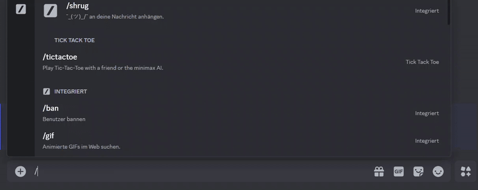

# ex2-k12205739-k12222785


# Tic-Tac-Toe Discord Bot

A Discord bot that lets you play Tic-Tac-Toe directly in a channel, either **against another user** or **versus a minimax-based AI**. The board is displayed via interactive Discord buttons, and the bot immediately updates the message whenever a player (or the AI) makes a move.



## Features

1. **Minimax AI**  
   - Choose `/tictactoe mode:ai` to challenge the computer.
2. **Player vs. Player**  
   - Invite another user to a friendly match with `/tictactoe mode:player opponent:@Username`.
3. **Interactive Buttons**  
   - Each cell is a Discord button; no text commands required.
4. **Instant Board Updates**  
   - The board updates automatically on every move. 


---

## Getting Started

### Prerequisites

Make sure you have the following installed:

- **Python 3.8+**
- **`discord.py` Library**

### Installation

1. Clone this repository or download the files.
2. Install the required dependencies:
   ```bash
   pip install discord
   ```

## Create a Discord Bot

### Step 1: Enable Developer Mode

1. Go to **User Settings** in Discord.
2. Navigate to **Advanced** and enable **Developer Mode**.

[Guide for enabling Developer Mode](https://www.partitionwizard.com/partitionmagic/discord-developer-mode.html)

---

### Step 2: Create a Bot in the Discord Developer Portal

1. Visit the [Discord Developer Portal](https://discord.com/developers/applications).
2. Create a new application, then add a bot user.
3. Copy your **Bot Token**.

[Detailed guide to creating a bot](https://www.ionos.at/digitalguide/server/knowhow/discord-bot-erstellen/#:~:text=Aktivieren%20Sie%20in%20Ihrem%20Discord,und%20klicken%20Sie%20%E2%80%9ECreate%E2%80%9C.)


## Set Up a Discord Server

### Step 1: Copy Server ID (GUILD_ID)

1. Right-click the server icon.
2. Click **Copy Server ID**.

---

## Configuration

1. Replace the following environment variables in your bot's code:
   - **TOKEN:** Replace `"YOUR_BOT_TOKEN"` with the token you copied from the Discord Developer Portal.
   - **GUILD_ID:** Replace with the Server ID of your Discord server.

### Example:

```python
TOKEN = "YOUR_DISCORD_BOT_TOKEN"
GUILD_ID = 123456789012345678
```

## Run the Bot

1. Start the bot by running the following command:
   ```bash
   python bot.py
   ```
2. You should see `Bot is ready...` in your console when the bot is up and running.


# Usage

Once the bot is active in your Discord server, you can use the following commands:

## 1. AI Mode
Play against the minimax AI with the command:

```bash
/tictactoe mode:ai
```
You (Player X) will face the AI (Player O).

## 2. Player vs Player Mode
Challenge another server member:

```bash
/tictactoe mode:player opponent:@Friend
```
You (Player X) will compete against the mentioned user (Player O).